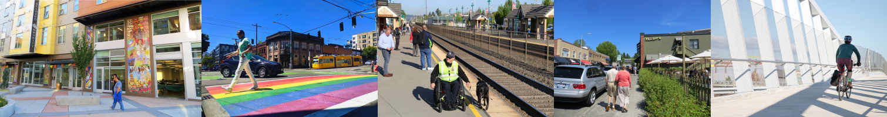

---
output:
  pdf_document:
    latex_engine: lualatex
    includes:
      in_header: "trend_format_hts.tex"
  html_document:
    df_print: paged
fontsize: 12pt
---

\setmainfont{Poppins}

# Trends in Walking and Biking 
```{r setup, include=FALSE}

options(tinytex.verbose=TRUE)
library(psrcplot)
library(psrccensus)
library(tidyverse)
library(knitr)
library(magick)
library(openxlsx)
library(htmlwidgets)

source('data-processing-template.R')

output_dir<-file.path(getwd(), 'outputs')


# Create Image 
image1 <- image_read("plaza_roberto.png")
image2 <- image_read("pride_pedestrian.jpg")
image3 <- image_read("puyallup_transit.jpg")
image4<-  image_read("hectors-walking.jpg")
image5<- image_read("northgate_cyclist.jpg")
input <- c(image_scale(image1, "x200"), image_scale(image2, "x200"), image_scale(image3, "x200"),  image_scale(image4, "x200"),  image_scale(image5, "x200"))
walking_image_header <- image_append(input)
image_write(walking_image_header, path="walking_image_header.png", format="png")
install_psrc_fonts()
walking_image_header
```
{width=100%}
\begin{flushleft}
The 2021 regional travel survey collected day-to-day information from households in the central Puget Sound region, such as how we traveled, where we went, how long it took—even where we chose to live and whether we got home deliveries. This report compares household travel choices in 2021, during COVID-19 to previous survey years of 2017 and 2019. Learn more at the \href{https://www.psrc.org/our-work/household-travel-survey-program}{\underline{\textcolor{blue}{PSRC household travel survey webpage}}}. You can also \href{https://household-travel-survey-psregcncl.hub.arcgis.com}{\underline{\textcolor{blue}{view the full travel survey dataset here}}}, including 2017, 2019 and 2021 data.
\end{flushleft}

## People walked more and used transit less in 2021
\begin{flushleft}
In 2021, the regional walk mode share was 15\% and 
the regional bike mode share was 1\%. Compared to previous surveys, 
walking and biking trips increased and transit trips decreased.  

The walk trip mode share was over 30\% in 2021 for social,
recreational, and meal trips. A greater proportion of trips was made
for these purposes in 2021 when compared to 2017/2019 survey responses.  
Driving remained around 80\% of trips, consistent with previous years. The 2017 and 2019 survey samples have been combined in this analysis to strengthen the statistical validity of the findings by increasing the number of respondents in each calculation. Lines above the columns in each chart indicate the margin of error.
\end{flushleft}


```{r, echo=FALSE, results=TRUE,  fig.dim=c(6,4)}
wb <- createWorkbook()
xlsx_file <- "bike_ped_hhts_2021.xlsx"

```


```{r overallmodeshare, echo=FALSE, results=TRUE,  fig.dim=c(6,4), fig.dim=c(6,4) }
# pull the data from Elmer, group, and organize it, write to csv


trips_by_mode_no_drive<-trips_by_mode%>%filter(!mode_simple %in% c('Drive', 'Other'))

trips_by_mode_trend<-static_column_chart(t=trips_by_mode_no_drive, x='mode_simple', y='share', fill='year', moe='share_moe', est='percent', color = "pgnobgy_5", title="Non-Driving Trip Mode Shares")

trips_by_mode_trend

trips_by_mode_trend_int<-interactive_column_chart(t=trips_by_mode_no_drive, x='mode_simple', y='share', fill='year', moe='share_moe', est='percent', color = "pgnobgy_5", title="Non-Driving Trip Mode Shares")

saveWidget(trips_by_mode_trend_int, 
           file=paste0(output_dir,'/trips_by_mode_no_drive.html'))

#trips_by_mode_trend_int<-create_column_chart(t=trips_by_mode_no_drive, x='mode_simple', y='share', f='year', moe='share_moe', est='percent', color = "pgnobgy_5", title="Non-Driving Trip Mode Shares", interactive='yes')

#%>%layout(xaxis=list(title='Trip Mode'),yaxis=list(title='Percent of All Trips') )

#saveWidget(trips_by_mode_trend_int, file=paste0(output_dir, '/trips_by_mode.html'))

addWorksheet(wb = wb, sheetName = 'trips_by_mode', gridLines = FALSE)
writeDataTable(wb = wb, sheet = 'trips_by_mode', x = trips_by_mode_no_drive)

```


\subsection{Conclusion}
\begin{flushleft}
People were walking and biking more in 2021 than in previous years but using transit less. COVID-19 conditions contributed to this substantial shift in behavior across most demographic groups. The 2023 household travel survey will show whether these patterns continue.
\end{flushleft}

